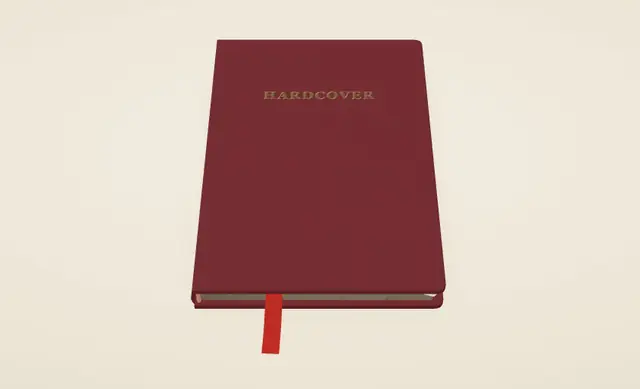
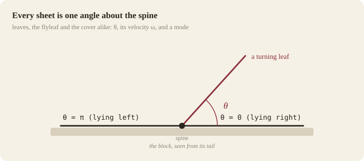
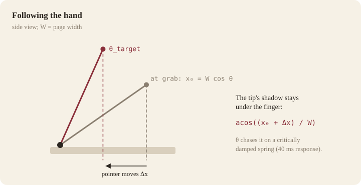
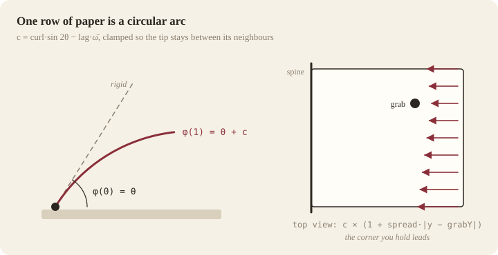
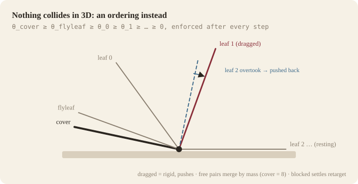
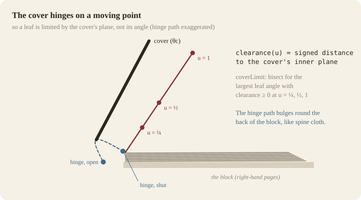
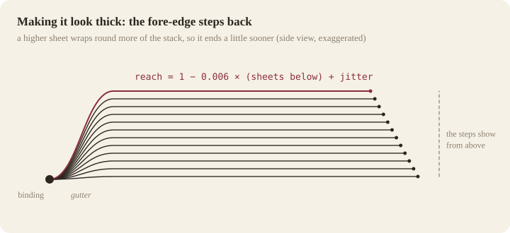
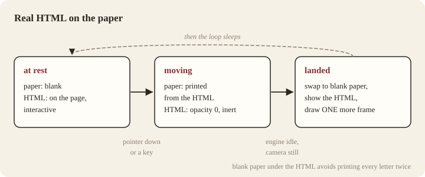

# How hardcover works

*A hardcover book for the web whose pages you can drag, flick, catch mid-air and close — and why almost all of it comes down to one angle per sheet.*

hardcover is two small pieces:

- **an engine** (`src/engine/`, about 700 lines of dependency-free TypeScript) that knows the physics of a bound book: where each sheet is, where it is heading, and what it must never pass through;
- **a renderer** (`src/render/book.ts`, three.js) that turns those numbers into boards, a spine, a paper block and bending sheets, plus a small helper (`src/render/print-dom.ts`) that prints live HTML into the paper.

This article walks through the model, the hand-feel, the geometry that keeps the book solid, the tricks that make it read as *thick*, how real HTML can lie on a page, and how all of it is tested. It assumes you are comfortable with a little trigonometry and have seen a vertex shader before. Every number quoted is a default you can change in the demo's panel.



## Contents

1. [What it had to feel like](#1-what-it-had-to-feel-like)
2. [One angle per sheet](#2-one-angle-per-sheet)
3. [Following the hand](#3-following-the-hand)
4. [Letting go](#4-letting-go)
5. [Catching a page in the air](#5-catching-a-page-in-the-air)
6. [The bend](#6-the-bend)
7. [Nothing collides in 3D](#7-nothing-collides-in-3d)
8. [Closing the book](#8-closing-the-book)
9. [When the axes are not shared](#9-when-the-axes-are-not-shared)
10. [Making it look thick](#10-making-it-look-thick)
11. [Real HTML on the paper](#11-real-html-on-the-paper)
12. [Drawing only when something moves](#12-drawing-only-when-something-moves)
13. [Testing a thing that moves](#13-testing-a-thing-that-moves)
14. [The knobs](#14-the-knobs)
15. [Limits](#15-limits)
16. [Credits and related work](#16-credits-and-related-work)

---

## 1. What it had to feel like

Page-turn effects on the web tend to be one of two things: a canned animation you trigger with a click, or a 2D corner fold on flat images. We wanted a book you could *handle*. Before writing code we wrote down what that means, as things you could check:

1. **Follows the hand.** While dragging, the paper stays under the pointer with no visible lag, wherever you grabbed it.
2. **Flicks.** A quick throw turns the page even if it barely moved. A slow drag past half-way also turns it. Anything else falls back.
3. **Interruptible.** A page in the air can be grabbed again and pulled either way. Nothing has to "finish playing".
4. **Lands softly.** A released page settles on a spring — no jitter, no dead stop.
5. **Smooth, then silent.** 60 fps (and smooth on 120 Hz) while moving; **no animation frames at all** when nothing moves.
6. **Any input.** Mouse, trackpad, touch and keyboard; `prefers-reduced-motion` lands every turn at once.
7. **A real book.** A hardcover with a spine and a paper block you can see getting thicker on one side and thinner on the other — and a cover you can pull shut, pages and all.

We explicitly did **not** aim for an iBooks-style corner curl. Slow down some of the most pleasing page turns on the web and many of them are, underneath, a sheet *rotating about the spine* with a little softness in it. That model is much simpler, and — as the rest of this article shows — it makes the hard parts (collisions, closing, thickness) tractable.

## 2. One angle per sheet

Look at a book from its tail (the bottom edge). Every sheet is bound at the spine and swings about it. So each sheet — every turnable leaf, the flyleaf glued into the cover, and the cover itself — is described by **one hinge angle θ**:

- θ = 0: lying flat on the right,
- θ = π: lying flat on the left.



On top of θ each sheet carries a little state:

```ts
interface Sheet {
  theta: number;   // hinge angle, 0 … π
  omega: number;   // angular velocity, rad/s
  mode: "rest" | "drag" | "settle" | "bundle";
  target: number;  // where a settle is heading: 0 or π
  bend: number;    // low-passed angular velocity, drives the paper's lag
  grabY: number;   // where along the height it was grabbed, −0.5 … 0.5
  // … plus drag bookkeeping and bend limits
}
```

The modes are the whole behaviour:

| mode | what drives θ |
| --- | --- |
| `rest` | nothing; the sheet lies still |
| `drag` | the pointer, through a stiff spring |
| `settle` | a spring toward 0 or π |
| `bundle` | the cover, while it opens or closes (§8) |

Lengths are in **page widths**: a page is 1 wide and `H` tall (1.48 in the demo). The engine never touches a renderer; `BookEngine.step(dt)` advances every sheet from one clock, so tests can run it with no browser at all (§13).

## 3. Following the hand

The renderer turns a pointer into a point on the book (next paragraph). The engine only needs its **x** across the spread, from −1 (left fore-edge) to +1 (right fore-edge).

The key choice is *what* follows the finger. Seen from above, the tip of a sheet at angle θ projects to

$$x_{tip} = W\cos\theta.$$

On grab we remember that projection, `grabX0 = W·cos θ`, and the pointer's x, `px0`. As the pointer moves by Δx, the target angle is the one whose tip projects to the moved point:

$$\theta_{target} = \arccos\!\left(\frac{x_0 + \Delta x}{W}\right)$$



So the edge you hold stays under your finger for the whole turn, whichever point of the page you took. (Lifting a page toward you is not something a flat pointer can express; projection is the honest mapping.)

θ does not jump to the target. It chases it with a critically damped spring with a 40 ms response:

```ts
[sheet.theta, sheet.omega] = springStep(sheet.theta, sheet.omega, sheet.thetaTarget, 1, p.follow / 1000, dt);
```

That is short enough to read as "same frame" but smooths the stair-steps of coarse pointer events, and — more importantly — it keeps `omega` meaningful during a drag, which the bend (§6) and the release (§4) both feed on. Set `follow` to 0 and the sheet is pinned to the pointer exactly.

**Pointer to page.** The sheets are bent on the GPU (§6), so a CPU raycast against their meshes would miss. We don't need the bent surface: we cast the pointer's ray into the book's local frame and intersect it with the flat plane of the block's top. That gives x (and y, which the bend uses to decide which corner leads) in page units, whatever the camera and the book's tilt.

## 4. Letting go

On release we need a velocity. The renderer keeps the last **80 ms** of pointer samples, timestamped with the **wall clock** (`performance.now()`, not the engine's clock — if the tab throttles animation frames, engine time can stall while the hand keeps moving), and passes `vx` in page widths per second.

The decision is two rules:

```ts
const progress = sheet.origin === 0 ? sheet.theta / PI : 1 - sheet.theta / PI;
if (Math.abs(vx) >= p.flick) target = vx < 0 ? PI : 0;                     // a throw: direction wins
else target = progress >= p.threshold ? oppositeSide : sideItCameFrom;   // a slow release: half-way wins
```

with `flick = 1.2` page widths per second and `threshold = 0.5`.

The release speed is then handed to the settle spring as an angular velocity. Differentiating the tip projection, ẋ = −W sin θ · ω, so

$$\omega_0 = -\frac{v_x}{W\,\max(\sin\theta,\ 0.35)}$$

clamped to ±12 rad/s. The floor on sin θ stops a nearly flat page from receiving an absurd spin; the clamp stops a violent throw from looking broken. A hard flick therefore arrives with a little overshoot, a lazy one just drifts over — without any special casing.

**The spring.** Settles use Apple's parameterisation — a *damping ratio* ζ and a *response* (the period of the undamped oscillation) — because those two numbers mean something to a designer, where stiffness and damping coefficients do not:

```ts
export function springStep(x, v, target, damping, response, dt) {
  const w = (2 * PI) / Math.max(0.01, response);
  const k = w * w;             // stiffness
  const c = 2 * damping * w;   // damping coefficient
  let t = dt;
  while (t > 0) {              // semi-implicit Euler, sub-stepped at 1/240 s
    const h = Math.min(t, 1 / 240);
    v += (k * (target - x) - c * v) * h;
    x += v * h;
    t -= h;
  }
  return [x, v];
}
```

Pages use ζ = 0.82, response 0.5 s: a hair under critical, so a thrown page lands with the faintest settle. Sub-stepping keeps a 50 ms frame (a hiccup, a background tab) stable. A sheet is declared at rest when |θ − target| < 0.0015 and |ω| < 0.02; it snaps exactly to 0 or π so the stack is exact again.

Taps are releases too: a press that did not move, shorter than 250 ms, is released with 1.5 × the flick speed — right page forward, left page back, a shut book opens.

## 5. Catching a page in the air

Because a settling sheet is just a spring toward a target, "interrupting" needs no special machinery. `grab` looks at what is in flight first:

```ts
const flying = this.leaves.filter((l) => l.mode === "settle");
if (flying.length) {
  // Catch the one whose tip is nearest the pointer.
  flying.sort((a, b) => Math.abs(W * Math.cos(a.theta) - x) - Math.abs(W * Math.cos(b.theta) - x));
  sheet = flying[0];
}
```

The caught sheet switches to `drag` with `thetaTarget = theta` and `grabX0` taken from where it *is*. Its leftover ω is absorbed by the 40 ms follow spring within a frame or two — the page stops in your hand — and from there it is an ordinary drag: pull it back, throw it on, let it go.

## 6. The bend

A rigid sheet swinging about the spine looks like a door. Paper needs two kinds of softness:

- **lift curl** — as you lift a page, its root stays down on the stack a moment longer than its tip: `curl · sin 2θ` (zero flat on either side, strongest half-way up);
- **motion lag** — a moving page's tip trails its root: `−lag · ω̄`, where ω̄ is the angular velocity through a 90 ms low-pass (so a fast flick bows the sheet and the bow relaxes as it lands).

Together they give one number per sheet, the **arc** `c` (radians of turn across the page):

```ts
bendOf(sheet) {
  const c = p.curl * Math.sin(2 * sheet.theta) - p.lag * sheet.bend;
  return clamp(c, sheet.bendMin, sheet.bendMax);   // never through a neighbour (§7)
}
```

The renderer bends each row of the sheet into a circular arc. At fraction u across the page (0 at the spine, 1 at the fore-edge), the paper's direction is φ(u) = θ + c·u. Integrating the unit tangent (cos φ, sin φ) over the page length L gives a closed form:

$$x(u) = L\,\frac{\sin(\theta + c\,u) - \sin\theta}{c},\qquad z(u) = L\,\frac{\cos\theta - \cos(\theta + c\,u)}{c}$$

(and the straight line L·u·(cos θ, sin θ) when c ≈ 0). The arc grows away from the row you grabbed — `c · (1 + spread·|y − grabY|)` — so the corner you are holding leads and the far corner trails. Finally the arc is clamped to [−θ, π − θ] so no part of the page can go through the table or past flat on the other side.



In three.js this is a few lines injected into `MeshStandardMaterial` with `onBeforeCompile`, which keeps the standard PBR lighting:

```glsl
vec3 bent(vec2 p) {
  float u = p.x / uW;
  float yy = p.y / uH;
  float c = uBend * (1.0 + uSpread * abs(yy - uGrabY));
  c = clamp(c, -uTheta * 0.97, (3.14159265 - uTheta) * 0.97);
  float L = uW * uReach;
  float x, z;
  if (abs(c) < 1e-4) { x = L * u * cos(uTheta); z = L * u * sin(uTheta); }
  else { x = L * (sin(uTheta + c * u) - sin(uTheta)) / c; z = L * (cos(uTheta) - cos(uTheta + c * u)) / c; }
  // … plus the gutter (§10)
  return vec3(x, p.y, z + uZRoot + dip);
}
```

Each sheet is a 56 × 24 subdivided plane. `transformed = bent(position.xy)` moves the vertex; the normal is a finite difference of the *same* function one grid cell either way (`normalize(cross(bent(p+dx) − bent(p−dx), bent(p+dy) − bent(p−dy)))`), so light slides across the curve correctly and the gutter shades itself. One plane carries both faces: the fragment shader samples the front texture when `gl_FrontFacing`, otherwise a second texture with u mirrored, and darkens the fold slightly with the bend.

The same function exists on the CPU (`bentPoint`) for the one place that needs it: placing HTML on a page (§11).

## 7. Nothing collides in 3D

A book is a stack of sheets that must never pass through one another. The obvious approach — collision volumes, a physics library, per-triangle tests — is expensive and fragile for surfaces a fraction of a millimetre apart.

But every sheet turns about **the same axis**. For coaxial sheets, "cannot pass through" is not a 3D question at all. It is an ordering:

$$\theta_{cover} \;\ge\; \theta_{flyleaf} \;\ge\; \theta_{leaf\,0} \;\ge\; \theta_{leaf\,1} \;\ge\; \dots \;\ge\; 0$$



`resolveChain` enforces it after every physics step with one pass forward and one back (so a push travels down a run of sheets in either direction). For each neighbouring pair (a, b) where b has overtaken a:

- if one of them is being **dragged**, it is rigid: the other is pushed to its angle and its velocity limited to the pusher's;
- if **both are free**, they merge — mass-weighted angle and velocity, the cover counting as 8 pages — so a heavy cover carries paper and a page does not stop a cover;
- a pushed sheet that was at `rest` **wakes** into a settle toward its nearer side;
- a settling sheet that is blocked by a *resting* one **retargets** to the blocker's angle. Without this it would press against the blocker forever, never reach its target, and the render loop could never go to sleep.

It is O(N) with no allocation, and it cannot tunnel: there is nothing to step over.

The renderer needs one more guarantee, because sheets bend: the *tip* of a bent page must also stay between its neighbours. After ordering, each sheet gets `bendMax = θ_outer − θ` and `bendMin = θ_inner − θ`, and `bendOf` clamps to them.

> This idea is not new. The 3D FlipBook jQuery plugin (2017) keeps its sheets sorted by angle and resolves elastic collisions between neighbours in a 1D physics simulation. If you know of earlier work, please open an issue so we can credit it.

## 8. Closing the book

The cover is a sheet like any other — same drag, flick, catch and settle — with a heavier spring (ζ = 0.92, response 0.72 s), a lower release cap (0.6×) and no bend. What makes closing interesting is what happens to the pages on its side.

When the cover starts to move, the engine gathers a **bundle**: the flyleaf (glued to the cover: it copies the cover exactly) and every leaf currently lying on the left, innermost deepest. Each bundled sheet chases a target just ahead of the cover:

$$\theta_{target} = \theta_{cover} - fan \cdot depth \cdot \sin\theta_{cover}$$

with its own critically damped spring, response `0.10 + 0.025·depth` s. The `sin θ` makes the fan open in the middle of the motion and close again at both ends, so the pages arrive together; the deeper, slower springs make the innermost pages fall first, like a real book falling shut. When the cover lands, the bundle lands with it: shut, every page lies right (a book that is opened again starts at the first spread); opened, they return to the left.

## 9. When the axes are not shared

§7 assumed all sheets share one axis. A real hardcover does not quite:

- **The cover's hinge moves.** Lying open, the board hinges on the table beside the block (x = −0.035, z = board thickness). Shut, it lies *on top of* the block, so its hinge must be up there (z ≈ block height) and just outside the block's back.
- **Pages are bound at different heights.** Leaf *i* is bound at its own level in the block, `bindZ(i) = boardT + (fillR + n − i)·leafT`, whichever side it lies on.
- **The gutter lifts the paper.** Near the spine a resting page curves up from its binding to the flat top of the stack (§10), so the flat part of a page is higher than its root.

In an early version the cover's hinge slid in a straight line from the open to the shut position and the cover was limited by the angle ordering alone. The cover visibly cut into the pages as it closed. The fix has three parts:

1. **Honest heights.** Every sheet has a fixed binding height and a flat height that blends from "top of the right stack" to "its layer on the left" as it turns (`flatZ(i, θ)`). The engine and the shader use the same functions.
2. **A plane test instead of an angle test.** The cover's limit on a leaf is solved against the cover's actual plane — through its hinge, with normal (sin θc, −cos θc). `clearance(i, θ, θc, u)` is the signed distance of the point u along the leaf to that plane, and `coverLimit(i, θc)` bisects (14 steps) for the largest leaf angle whose points at u = ¼, ½ and 1 stay outside. That limit replaces θc wherever the chain compares a leaf with the cover.
3. **A hinge path that wraps the spine.** Half-way through, the hinge bulges outward and upward (`bulge · sin(πm)`) along the path a spine cloth actually takes round the back of the block, so the cover's inner face stays outside the bindings throughout.



The lesson generalises: an ordering of angles is exact only for coaxial rotation. When one member of the chain hinges somewhere else, compare positions, not angles — but only for that pair, and only at a few points.

## 10. Making it look thick

Physics made the book behave; these details make it read as a solid object with pages in it.

**The stepped fore-edge.** Seen from above, the pages of a thick stack do not end in one line. Each sheet reaches slightly less far than the one beneath it, because it has to wrap round more of the stack at the spine. Every sheet's length is shortened by the number of sheets under it:

```ts
const reachOf = (below) => 1 - 0.006 * below;   // plus a fixed per-sheet jitter
```

and a turning leaf blends from its right-hand count to its left-hand count as it goes over. Turn a few pages and the left stack visibly grows a band of edges while the right one shrinks. The jitter (±0.002) matters: perfectly even steps read as a ruled pattern, not paper.



**Block sides.** The fore-edge, head and tail of each stack are ruled strips with one row of vertices per resting sheet, rebuilt from whatever lies on each side at that moment (a sheet in flight belongs to neither), textured with a strip of real page-edge photography.

**The gutter.** Within 22 % of the page width from the spine, a lying sheet curves from its binding height to its flat height:

```glsl
float dip = (uZFlat - uZRoot) * abs(cos(uTheta)) * (1.0 - pow(max(0.0, 1.0 - u / 0.22), 2.0));
```

`abs(cos θ)` fades it out as the page stands up. Because normals come from the bent surface, the gutter darkens under the studio lighting by itself — no painted shadow needed.

**Shadows without shadow maps.** A turning sheet lays a soft gradient on the stack below it: a quad from the spine to the projection of its tip, alpha `0.42 · sin(θ)^0.6`, fading toward the fore-edge. The book sits on a blurred rounded rectangle that widens as the cover opens. Cheap, stable, and free of the shadow acne a shadow map would produce between surfaces 0.0025 page widths apart.

**Materials.** The boards use Poly Haven's CC0 *Book Pattern* normal, roughness and AO maps, with its colour map reduced to a grey weave that tints any cloth colour. The environment is a tiny procedural studio (a grey box and three soft boxes) baked once through `PMREMGenerator` — enough to make the cloth read as cloth and the foil title as metal.

## 11. Real HTML on the paper

The demo's page 4 is a form. While the book is still, you can click into it, type and select text, because it is real HTML lying on the paper. When anything moves, it becomes ink on the moving sheet.

The pattern has two states:

| | the paper texture | the HTML page |
| --- | --- | --- |
| **resting** | blank paper | visible, positioned over the face, interactive |
| **moving** | the page, printed | put away (opacity 0, `inert`), still laid out |



**Placing the HTML.** The page is authored at a fixed CSS size (500 × 740). `faceTransform(face, 500, 740)` uses the CPU copy of the bend (§6) to project three points of the face to the screen and returns a scale and a translate. A 2D transform can only match a page that faces the camera, so the demo only brings the HTML out in its zoomed-in *reading view*, and relaxes the gutter there (it keeps the flat heights and raises the bindings to them) so the paper is flat to within a pixel.

**Printing the HTML.** `printDom(root, ctx, …)` draws a page from its own live layout rather than re-describing it: backgrounds and borders from `getBoundingClientRect` and computed styles, every word of text from `Range.getClientRects()` (the baseline is placed by splitting the word's line box in the ratio of the font's ascent to descent), inputs from their value or placeholder. Since positions are read back from the browser, print and page agree: in `verify/` the printed page and the live page differ by a mean of 1.6/255 per pixel, all of it anti-aliasing at the glyph edges.

**Why blank paper under the HTML?** Because the HTML text is transparent-backed. Print under live text and every letter is drawn twice, a fraction of a pixel apart, which reads as a ghost.

**The frame you have to draw twice.** On entering rest we swap the print for blank paper *after* the frame that noticed everything was still has already been drawn — and that same frame decided the loop could sleep. The canvas then holds the print under the live page, ghosting, until something else moves. The fix is small and easy to forget: entering rest returns "the paper changed", and the loop draws one more frame.

A future note: Chrome's HTML-in-Canvas API (in origin trial in 2026) draws live DOM straight into a WebGL texture, which could replace the printing step entirely where it is available.

## 12. Drawing only when something moves

```ts
idle() {
  return !this.active && !this.bundle && this.pending.length === 0 &&
    this.chain.every((s) => s.mode === "rest" && Math.abs(s.bend) < 0.01);
}
```

The demo's loop keeps requesting animation frames while the book is not idle or the camera springs are moving, and stops otherwise. Anything that can change the picture calls `wake()`: pointer and key input, parameter changes, a resize, and `book.onInvalidate` (fired when a texture or the title font finishes loading). `dt` is clamped to 50 ms so a long gap cannot fling the springs.

The status line in the corner of the demo says `render loop: asleep` when nothing moves. On a laptop, that is the difference between a page that warms the machine and one that doesn't.

## 13. Testing a thing that moves

**The engine, without a browser.** Because `step(dt)` is the only clock, a test can drive a drag exactly:

```ts
function drag(engine, x0, x1, seconds) {
  const sheet = engine.grab(x0, 0);
  for (let i = 1; i <= seconds * 120; i++) {
    engine.move(x0 + ((x1 - x0) * i) / (seconds * 120));
    engine.step(1 / 120);
  }
  engine.release((x1 - x0) / seconds);
  return sheet;
}

it("a page in flight can be caught, pulled back and let go", () => {
  const e = makeBook();
  drag(e, 0.9, 0.7, 0.05);   // a flick
  run(e, 0.09);              // 90 ms later it is in the air
  const caught = e.grab(0.2, 0);
  expect(caught).toBe(e.leaves[0]);
  // … pull it back to the right and release: it lands where it started
});
```

`npm test` runs 20 of these: following, falling back, flicking, catching, turning back, staying within [0, π], staggered programmatic turns, reduced motion, closing with pages, the ordering never violated while a page is still turning as the cover shuts, bend limits, and a **geometry probe**: over a whole close — just after a flick, and dragged shut by hand — it samples 40 points along every turned leaf against the cover's inner plane and asserts nothing goes deeper than 0.2 % of a page width. The probe checks that the constraints hold in the engine's geometry; the renderer draws from the same functions (`bindZ`, `flatZ`, `coverPlane`, `GUTTER_SPAN`), which is what keeps the drawn book honest.

**The demo, in a real browser.** Visual effects have a special failure mode: a hidden or throttled tab stops `requestAnimationFrame`, and an animation that never runs "passes" every state check. So `verify/run.mjs` launches headless Chrome itself, serves the build, and drives it over the DevTools protocol with `Input.dispatchMouseEvent` — the same hit-testing and pointer events a hand produces. It checks, in order: the book loads shut and the loop sleeps; a tap opens it; a slow drag past half-way turns a page; a short slow drag falls back; a 40 ms flick turns one; a page caught 70 ms after a flick comes back; Esc closes with the pages riding along; Enter reopens; arrow keys turn; **frame pacing while pages turn** (60 fps, worst gap 16.8 ms on an M4 Pro, Chrome 152); the reading view places the live page on blank paper; typed text is printed onto the turning page; back at rest the HTML returns with its value; the loop sleeps again; reduced motion opens at once; and no console errors. It saves screenshots of each state — including the canvas alone under the live page, to catch the ghost from §11.

## 14. The knobs

All live in `engine.params` and in the demo's panel.

| param | default | what it does |
| --- | --- | --- |
| `follow` | 40 ms | response of the drag spring; 0 pins the page to the pointer |
| `damping`, `response` | 0.82, 0.5 s | the settle spring for pages |
| `flick` | 1.2 widths/s | release speed that turns a page regardless of progress |
| `threshold` | 0.5 | progress past which a slow release completes the turn |
| `kick` | 12 rad/s | cap on the release's angular velocity |
| `curl` | 0.32 rad | lift curl (× sin 2θ); negative makes the tip droop instead |
| `lag` | 0.12 | motion lag (× smoothed ω) |
| `bendResponse` | 0.09 s | low-pass on ω for the lag, and how fast a bend relaxes |
| `spread` | 0.7 | how much more the rows far from the grab point bend |
| `coverDamping`, `coverResponse` | 0.92, 0.72 s | the cover's settle spring |
| `fan` | 0.16 rad | how far each inner page falls ahead of a closing cover |

## 15. Limits

Being clear about what this is not:

- **Touch is implemented, not proven.** Input goes through Pointer Events and the automated checks use mouse events; it has not yet been tuned on real phones and tablets, and there is no small-screen layout.
- **One hand at a time.** One sheet is dragged at a time; there is no multi-touch riffling.
- **A hinge, not a curl.** Pages bend along their width only. There is no diagonal corner fold, crease or tear.
- **Moving text is a texture.** A turning page is a 768-pixel-wide canvas, so its text is softer than the crisp HTML at rest.
- **`printDom` is not a browser.** It prints text, boxes, borders and form fields. Images, gradients, shadows and transforms inside the page are not drawn.
- **WebGL is required.** This repository has no non-WebGL fallback.
- **Dozens of pages, not thousands.** Each leaf is its own mesh with its own textures. For long documents, page the content through a small number of physical leaves.
- **Accessibility is partial.** The canvas is labelled and keyboard-operable, page changes are announced, and the live HTML page is real HTML; the printed pages are pictures to assistive technology.

## 16. Credits and related work

- [three.js](https://threejs.org/) renders everything.
- [Book Pattern](https://polyhaven.com/a/book_pattern) by Rob Tuytel, Poly Haven (CC0), for the cloth and the page edges.
- [3D FlipBook](https://github.com/iberezansky/flip-book-jquery) (GPL-2.0), an earlier 3D flipbook whose sheet physics sorts sheets by angle and resolves collisions between neighbours — the same insight as §7.
- [mantine-book](https://github.com/gfazioli/mantine-book) (MIT), a React book you can drag from any point of the free edge, with a reflection-fold and a WebGL curl renderer and React content on its faces.
- [StPageFlip](https://github.com/Nodlik/StPageFlip) (MIT), a mature 2D page-flip library.
- The damping-ratio-plus-response spring parameterisation used across Apple's platforms.
- Chrome's [HTML-in-Canvas](https://developer.chrome.com/blog/html-in-canvas-origin-trial) origin trial, which may make §11's printing step unnecessary.

Code is MIT-licensed. If you build something with it, we would love to see it.
