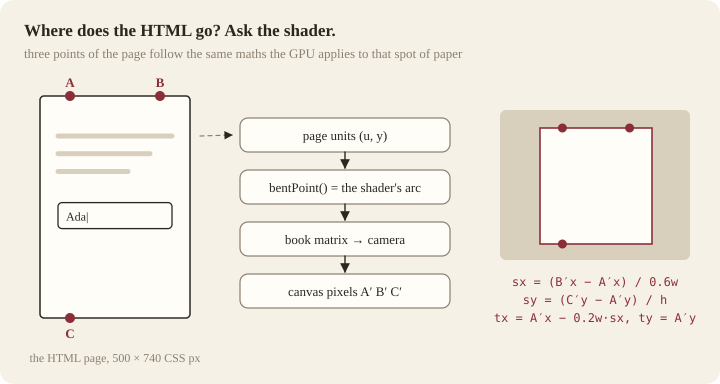

# Keeping HTML on a turning page

*How a text field can sit on a page of a WebGL book — clickable and typeable while the book is still, and carried on the paper, with what you typed, while the page turns.*

Open the [demo](https://jakezzz98.github.io/hardcover/), press **Z** for the reading view, turn to the guestbook page and type your name. Then drag the page. The field, its border and your name go over with the paper, bending with it; drop the page back and the caret is ready again.

This document explains how, step by step, with the code. It is the long version of §11 of [How hardcover works](how-it-works.md); the projection maths is in [§14 of the maths](math.md#14-putting-html-on-the-paper).

## Contents

1. [The problem](#1-the-problem)
2. [The options](#2-the-options)
3. [Two states and one rule](#3-two-states-and-one-rule)
4. [The HTML page](#4-the-html-page)
5. [Laying the page on the paper](#5-laying-the-page-on-the-paper)
6. [Leaving rest: turning HTML into ink](#6-leaving-rest-turning-html-into-ink)
7. [How the printer works](#7-how-the-printer-works)
8. [Coming back to rest](#8-coming-back-to-rest)
9. [Pitfalls](#9-pitfalls)
10. [How it is tested](#10-how-it-is-tested)
11. [What changes with HTML-in-Canvas](#11-what-changes-with-html-in-canvas)

---

## 1. The problem

The book is drawn by WebGL into one `<canvas>`. A page is a mesh whose vertices are moved by a vertex shader: it rotates about the spine and bends into an arc. A text field is a DOM element, laid out and painted by the browser in a flat box on top of (or under) the canvas.

To look like part of the paper, the field has to move exactly as the paper moves. While the paper lies flat and faces you, that is a 2D scale and translate. While it turns, it is not any transform the DOM can express:

- a **flat page rotating** in perspective maps a rectangle to a general quadrilateral — a homography, which CSS `matrix3d` can express;
- a **bent page** maps straight lines to curves. No single transform of a flat element can do that.

And the field has to keep working: focus, caret, text selection, IME composition, autofill, the value you typed.

## 2. The options

| approach | interactive while moving | follows a bending page | cost and catch |
| --- | --- | --- | --- |
| scale + translate the DOM page | yes | no — only a page facing the camera | free |
| CSS `matrix3d` on the DOM page | yes | only a flat page | cheap; breaks the moment the paper bends |
| slice the DOM into strips, each with its own `matrix3d` | no | roughly | clones lose focus, caret, IME and listeners; N copies to keep in sync |
| rasterise the DOM every frame | no | yes | a general rasteriser (html2canvas and the like) is far too slow at 60 fps — and nobody types into a moving page, so there is nothing new to draw |
| **print once when the page starts moving** (hardcover) | at rest only | yes | one print per gesture: ~0.6 ms |
| HTML-in-Canvas `texElementImage2D` | pixels stay live | yes | Chrome origin trial only (§11) |

The observation that makes the print approach work: **nobody types into a page while it is turning.** Interaction only has to exist at rest. While moving, the page only has to *look* right — and a picture of the HTML, mapped onto the bending mesh like any other page texture, bends perfectly for free.

## 3. Two states and one rule

| | the paper under the face | the HTML page |
| --- | --- | --- |
| **resting** | blank paper | on top of the face, visible, interactive |
| **moving** | a print of the HTML | invisible, `inert`, but still laid out |


**The rule:** anything that is about to move the paper or the camera must put the page to sleep *first*, synchronously, before the next frame is drawn. That includes a pointer pressing the paper, a key that turns a page, a click on "next", a change to the view, a resize, and a parameter change. The first frame that shows the page moving must already carry the print.

In the demo that is one function, called at the top of every such handler:

```ts
/** Leave the resting state: the DOM page becomes ink, and the paper can move. */
function leaveResting() {
  if (!resting) return;
  resting = false;
  if (document.activeElement === nameInput) nameInput.blur();
  book.repaintFace(FORM_FACE); // prints the live page as it is now, typed value included
  book.showFace(FORM_FACE, "print");
  formPage.classList.add("asleep");
  formPage.inert = true;
}
```

```ts
function startDrag(e: PointerEvent, target: Element) {
  const p = local(e);
  const got = book.pointerDown(p.x, p.y);
  if (!got) return;
  e.preventDefault();
  leaveResting();             // before the engine takes a single step
  dragging = e.pointerId;
  target.setPointerCapture(e.pointerId);
  wake();
}
```

The render loop also checks "resting but something is moving" and calls `leaveResting()`, but only as a safety net: by then one frame has already been drawn with blank paper under a page that has moved.

## 4. The HTML page

The page is ordinary HTML at a **fixed CSS size** — 500 × 740 pixels in the demo — so it can be laid out once and scaled onto the paper, whatever the screen size:

```html
<div id="form-page" class="asleep" inert>
  <p class="eyebrow">Guestbook</p>
  <h2>Write on the page</h2>
  <p class="body">Type your name, then turn the page: what you typed is printed into the paper that moves.</p>
  <label for="guest-name">Your name</label>
  <input id="guest-name" type="text" autocomplete="off" spellcheck="false" placeholder="Ada Lovelace" />
  <p class="note">While the book is still, this page is real HTML lying on the paper. …</p>
  <span class="folio">4</span>
</div>
```

```css
#form-page {
  position: absolute;
  left: 0;
  top: 0;
  width: 500px;
  height: 740px;
  transform-origin: 0 0;   /* the transform from §5 is written for this origin */
}
/* Put away, but still laid out: the printer reads its layout. */
#form-page.asleep {
  opacity: 0;
  pointer-events: none;
}
```

Three details matter:

- **Hide with `opacity: 0`, not `display: none`.** The printer measures the page's live layout; an element with `display: none` has no boxes to measure.
- **Not `visibility: hidden` either.** The printer skips elements whose computed visibility is hidden, so a page hidden that way prints blank.
- **Add `inert` while asleep.** Opacity does not stop keyboard focus: without `inert`, Tab would walk into an invisible field.

Background: transparent. The paper you see under the text is the book's own paper texture (§8 explains why it must be blank).

## 5. Laying the page on the paper

The HTML can only match the paper with a scale and a translate, so it comes out only when the page is **flat and facing the camera**. In the demo that is the reading view: the camera zooms onto the spread, the book's tilt goes to 0, and the gutter relaxes to 30 % of its depth so the paper near the spine is nearly flat. The loop brings the page out once everything has settled:

```ts
const still = !book.turning() && !viewMoving;
if (still && settings.reading && view.zoom === 1 && formFaceVisible()) paperChanged = enterResting();
else if (resting && !still) leaveResting();
```

Where to put it is answered by the renderer, `book.faceTransform(face, 500, 740)`. It takes three points of the DOM page — top-left-ish, top-right-ish and bottom-left-ish — and follows each one through exactly what the GPU does to that spot of paper:

1. DOM pixel → position on the page in page units (mirrored on a back face);
2. through `bentPoint`, the CPU copy of the vertex shader's `bent()` — same arc, same gutter, same heights;
3. through the book's world matrix and the camera's projection, to canvas pixels.



From the three projected points it reads off one scale per axis and a translate ([derivation](math.md#14-putting-html-on-the-paper)):

```ts
faceTransform(face, domW, domH) {
  book.updateMatrixWorld();
  const x0 = domW * 0.2;
  const x1 = domW * 0.8;
  const a = facePoint(face, x0, 0, domW, domH);
  const b = facePoint(face, x1, 0, domW, domH);
  const c = facePoint(face, x0, domH, domW, domH);
  const sx = (b.x - a.x) / (x1 - x0);
  const sy = (c.y - a.y) / domH;
  if (!(sx > 0.05) || !(sy > 0.05)) return null;   // edge-on or mirrored: not a place for HTML
  return { sx, sy, tx: a.x - x0 * sx, ty: a.y };
},
```

```ts
formPage.style.transform = `translate(${t.tx}px, ${t.ty}px) scale(${t.sx}, ${t.sy})`;
```

Using the CPU copy of the shader is the whole trick. If the placement used a separately written approximation of the page, the two would drift apart by a pixel here and there, and the text would visibly jump when the HTML is swapped in.

## 6. Leaving rest: turning HTML into ink

`leaveResting()` does four things in a deliberate order:

1. **Blur the field.** This ends IME composition and commits the value, so the print shows what the person actually typed, not a half-composed candidate. It also removes the focus ring, which should not be printed.
2. **Print.** `book.repaintFace(FORM_FACE)` repaints that face's 768-pixel canvas: paper first, then the demo's `paintFace` for that face, which is `printDom(formPage, …)` (§7). The canvas texture is flagged for upload.
3. **Show the print.** `book.showFace(face, "print")` points the sheet's material back at the face's own texture.
4. **Put the HTML away**: `asleep` + `inert`.

All of it runs synchronously inside the event handler, so the next frame — the first one in which the page can have moved — uploads and shows the print. Measured on the demo (M4 Pro, Chrome 152), step 2 takes a median of 0.6 ms and at most 1.4 ms, and the frame that uploads the texture keeps pace.

## 7. How the printer works

`src/render/print-dom.ts` does not try to be a browser. It asks the browser where everything already is, and draws that.

**Scale.** The DOM page may be on screen at any scale. With its bounding box on screen, its CSS size and the canvas width:

```ts
const scaleX = rootRect.width / pageWidth;   // screen px per CSS px
const scaleY = rootRect.height / pageHeight;
const k = canvasWidth / pageWidth;           // canvas px per CSS px
const X = (x: number) => ((x - rootRect.left) / scaleX) * k;
const Y = (y: number) => ((y - rootRect.top) / scaleY) * k;
```

**Pass 1: boxes.** For every element: its background (with border radius), its borders, and — for form fields — the value, or the placeholder in its `::placeholder` colour. A field's text is centred vertically inside its padding and clipped to its content box:

```ts
const centre = y + padT + (h - padT - padB) / 2;
g.fillText(text, tx, centre + (ascent - descent) / 2);
```

Checkboxes and radios get a drawn box and tick.

**Pass 2: text, word by word.** A tree walker visits every text node; a `Range` over each word returns the rectangle the browser laid that word out in, after wrapping, justification, letter-spacing and text-transform:

```ts
for (const match of node.data.matchAll(/\S+/g)) {
  range.setStart(node, match.index);
  range.setEnd(node, match.index + match[0].length);
  const rect = range.getClientRects()[0];
  // …
}
```

**The baseline.** `fillText` wants a baseline; the browser gives a box. For inline text the box's height is the font's content area, ascent plus descent, so the baseline divides it in that ratio. Canvas reports both for the same font:

```ts
const metrics = g.measureText(word);
const ascent = metrics.fontBoundingBoxAscent;
const descent = metrics.fontBoundingBoxDescent;
const baseline = top + (height * ascent) / (ascent + descent);
```

That is what puts printed text on the same pixels as the live text. Measured on the demo's guestbook page, the print and the live page differ by a mean of 1.6/255 per pixel, and every differing pixel is on a glyph edge.

**What it does not draw:** images, gradients, box shadows, outlines, transforms inside the page, SVG. Keep the live page to text, boxes and fields — or extend the printer.

## 8. Coming back to rest

```ts
/** Enter it when everything is still: returns true if the paper changed (so one more frame must be drawn). */
function enterResting(): boolean {
  if (resting) return false;
  const t = book.faceTransform(FORM_FACE, DOM_W, DOM_H);
  if (!t) return false;
  resting = true;
  formPage.style.transform = `translate(${t.tx}px, ${t.ty}px) scale(${t.sx}, ${t.sy})`;
  formPage.classList.remove("asleep");
  formPage.inert = false;
  book.showFace(FORM_FACE, "blank");
  return true;
}
```

**Why blank paper.** The HTML page has a transparent background, so whatever is on the paper shows through it. If the print stayed under the live text, every letter would be drawn twice a fraction of a pixel apart, which reads as a ghost or a bold smear. So at rest the face shows the book's plain paper, and the only text you see is the live text.

**Why one more frame.** The loop decides "everything is still" *after* drawing a frame. `enterResting()` swaps the texture to blank then — but that frame, with the print on it, is already on screen, and the loop was about to sleep because nothing is moving. The canvas would keep showing the print under the live HTML until something else woke the loop. So `enterResting()` returns true when it changed the paper, and the loop draws exactly one more frame:

```ts
// Swapping the print for blank paper happens after this frame was drawn: draw once more, or the print lingers.
if (!still || paperChanged || invalidated) raf = requestAnimationFrame(loop);
```

This bug is invisible in most testing — anything that wakes the loop, even a hover, hides it — which is why the verification script photographs the canvas alone under the live page (§10).

## 9. Pitfalls

- **Fonts.** Print before a web font has loaded and the print uses the fallback font. Print once after `document.fonts.ready`, and whenever the page's layout changes.
- **Autofill.** Chrome paints autofilled fields with its own background colour, which would sit on the paper like a sticker and would not match the print. Turn autocomplete off, or override `input:-webkit-autofill` (the usual trick is an inset `box-shadow` in the paper's colour).
- **Keyboard shortcuts.** If arrow keys turn pages, ignore them while the target is a field; otherwise moving the caret turns the page out from under the typist.
- **Resizing.** The transform is in canvas pixels. On resize, put the page to sleep and let the loop lay it out again.
- **Hit areas.** Only the fields should be interactive on the live page. Presses on the paper around them must still start a page turn — the demo listens for `pointerdown` on the DOM page and forwards anything that is not an input or label to the book.
- **Sharpness while moving.** A face texture is 768 pixels wide, so moving text is softer than live text. Wider textures are sharper and cost memory: a page-shaped RGBA texture is width × 1.48·width × 4 bytes (plus a third for mipmaps), about 3.5 MB at 768 and 14 MB at 1536, per face.
- **Accessibility.** The live page is real HTML with a real label, reachable only when it is on the paper; screen readers read it like any form. The printed version is a picture.

## 10. How it is tested

`verify/run.mjs` drives the built demo in headless Chrome over the DevTools protocol, with real input events, and checks:

1. in the reading view the live page comes out on the still paper, and **the paper under it is blank** (`book.faceShowing(3) === "blank"`);
2. clicking the field and inserting "Grace Hopper" types into the real input;
3. **while a page is being dragged, the face shows the print** (`"print"`) — the screenshot shows the name on the bending page;
4. back at rest, the live page returns **with its value**;
5. the render loop is asleep again;
6. a screenshot of the canvas **with the live page hidden**, to catch the lingering print from §8;
7. a screenshot of the same page as print, to compare pixel by pixel with the live page.

## 11. What changes with HTML-in-Canvas

Chrome's [HTML-in-Canvas](https://developer.chrome.com/blog/html-in-canvas-origin-trial) proposal lets a `<canvas layoutsubtree>` lay out its child elements and draw them into a WebGL texture with `texElementImage2D`, with a `paint` event when they change. As of mid-2026 it is an origin trial in Chrome, and other engines have not said they will implement it.

For this book it would remove the print step: the face's texture would be the live element, so a turning page would carry live, crisp pixels, updated as the person types. Two things would stay the book's job: placing clicks onto a page that has moved or bent, and a fallback for every browser without the API — which is exactly the print path described here.
